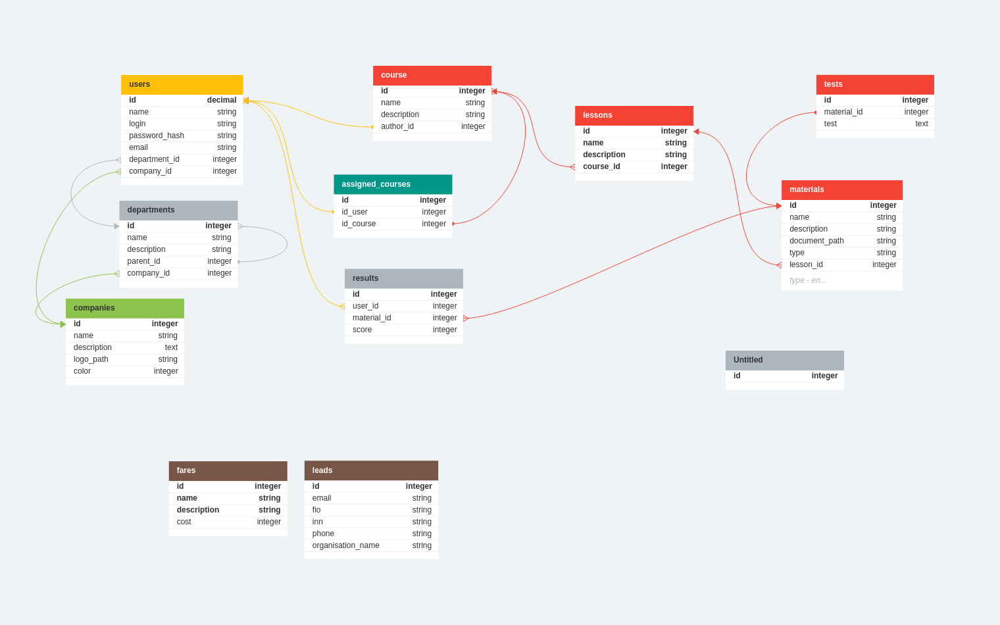

# project Gosling

### Installation:

Должны быть установленны все необходимые зависимости:
composer, php >= 8.1, php-pgsql, php-curl, php-intl,

```shell
git clone
```
```shell
composer install
```
```shell
docker-compose up -d
```
```shell
php artisan migrate --seed
```

Точка входа в приложение /dashboard

Лендинг находится в [отдельном репозитории](https://github.com/dwarf133/project-Rayan), точка входа / , инструции по тому как его установить находятся в ридми файле репозитория, между собой они связаны через конпку "Войти".

### Database schema:

